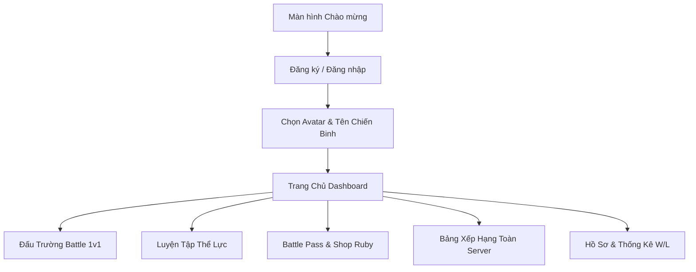

# 📖 HƯỚNG DẪN SỬ DỤNG ỨNG DỤNG FITNESS BATTLE

> **Dự án:** Fitness Battle — Nền tảng Gamification Luyện tập Thể hình & Thi đấu 1v1  
> **Phiên bản:** 1.0.1 (Android APK & Web Demo)  
> **Dành cho:** Thành viên nhóm, Khách hàng & Ban giám khảo trải nghiệm ứng dụng  

---

## 📑 MỤC LỤC
1. [Cài đặt & Khởi chạy ứng dụng](#1-cài-đặt--khởi-chạy-ứng-dụng)
   - [Cách 1: Cài đặt trực tiếp trên điện thoại Android (Khuyên dùng)](#11-cài-đặt-trên-điện-thoại-android-file-apk)
   - [Cách 2: Chạy Demo trên Trình duyệt Máy tính (PC/Laptop)](#12-chạy-demo-trên-máy-tính-web)
2. [Hướng dẫn Luồng sử dụng Trải nghiệm](#2-hướng-dẫn-luồng-trải-nghiệm-ứng-dụng)
   - [Màn hình Khởi động & Đăng ký / Đăng nhập](#21-màn-hình-chào-mừng--đăng-ký-tài-khoản)
   - [Trang Chủ (Home Dashboard)](#22-trang-chủ-dashboard)
   - [Đấu Trường 1v1 Real-time (Battle Arena)](#23-đấu-trường-thi-đấu-1v1)
   - [Hệ thống AI Pose Detection & Chống Gian Lận](#24-hệ-thống-ai-camera--anti-cheat)
   - [Hệ thống Battle Pass & Đấu Trường Ruby](#25-battle-pass--đấu-trường-ruby-tính-năng-thương-mại)
   - [Bảng Xếp Hạng (Leaderboard) & Hồ Sơ (Profile)](#26-bảng-xếp-hạng--hồ-sơ-cá-nhân)
3. [Xử lý các câu hỏi thường gặp (FAQ & Khắc phục lỗi)](#3-xử-lý-lỗi-thường-gặp-faq)

---

## 🚀 1. CÀI ĐẶT & KHỞI CHẠY ỨNG DỤNG

### 1.1. Cài đặt trên Điện thoại Android (File APK)
* **File cài đặt:** `FitnessBattle_Official.apk`
* **Yêu cầu hệ điều hành:** Android 7.0 trở lên

#### Các bước cài đặt:
1. **Chuyển file vào điện thoại:** Gửi file `FitnessBattle_Official.apk` qua Google Drive, Zalo hoặc cắm cáp USB vào điện thoại.
2. **Lưu file về máy:**
   * *Nếu nhận qua Zalo:* Nhấn dấu 3 chấm `...` cạnh file APK -> Chọn **Lưu vào máy** / **Mở bằng trình quản lý tệp**.
   * *Nếu tải qua Drive:* Nhấn **Tải xuống**.
3. **Mở trình cài đặt:**
   * Mở ứng dụng **Tệp (Files / File Manager)** trên điện thoại -> Vào thư mục **Tải về (Download)**.
   * Nhấn vào file `FitnessBattle_Official.apk` và chọn **Cài đặt (Install)**.
4. **Cấp quyền cài đặt ứng dụng ngoài:**
   * Nếu điện thoại hiện thông báo *"Bị chặn bởi Play Protect"* hoặc *"Nguồn không xác định"*: Nhấn chọn **Vẫn cài đặt (Install anyway)**.
5. **Khởi chạy ứng dụng:**
   * Mở icon ứng dụng **Fitness Battle** trên màn hình chính (Logo chiến binh màu vàng/đen).
   * Cấp quyền **Camera**, **Vị trí (Location)** và **Cảm biến** khi app yêu cầu để trải nghiệm đầy đủ tính năng AI.

---

### 1.2. Chạy Demo trên Máy tính (Web)
Dành cho việc trình chiếu trên máy tính hoặc chạy bản Web Preview:

1. **Mở thư mục dự án:** Mở thư mục `Demo MVP` bằng **Visual Studio Code**.
2. **Mở Terminal:** Nhấn tổ hợp phím **`Ctrl + \``** (hoặc chọn menu *Terminal -> New Terminal*).
3. **Khởi động server dev:**
   ```bash
   npm run dev
   ```
4. **Truy cập ứng dụng:** Giữ phím `Ctrl` và click chuột vào đường link `http://localhost:5173/` hiển thị trong terminal để mở app trên trình duyệt.

---

## 🎯 2. HƯỚNG DẪN LUỒNG TRẢI NGHIỆM ỨNG DỤNG



### 2.1. Màn hình Chào mừng & Đăng ký tài khoản
1. Mở app lần đầu sẽ xuất hiện màn hình giới thiệu 3 trụ cột: **Thi đấu 1v1**, **AI Huấn luyện**, **Bảng xếp hạng**.
2. Nhấn **"Tạo tài khoản mới"**:
   - Nhập **Tên chiến binh** (VD: *Alex Fitness*)
   - Nhập **Email** & **Mật khẩu** (tối thiểu 6 ký tự)
3. **Chọn Avatar:** Lựa chọn phong cách đại diện ưa thích trong bộ sưu tập và nhấn **"Vào Đấu Trường"**.

---

### 2.2. Trang Chủ (Dashboard)
Trang chủ là trung tâm thông tin của người chơi:
* **Thanh Header:** Lời chào theo thời gian thực + Cấp độ (Level), Thanh tiến trình kinh nghiệm (XP Bar), Số lượng Ruby (💎).
* **Chuỗi ngày luyện tập (Streak 🔥):** Theo dõi chuỗi ngày tập liên tục để nhân điểm thưởng.
* **Thanh Navigation 5 Tab chính:**
  * 🏠 **Trang chủ:** Tổng hợp chỉ số, nhiệm vụ hàng ngày, bảng tin mạng xã hội thể thao.
  * ⚡ **Battle Pass:** Cấp độ mùa giải, mở khóa Skin khung, hiệu ứng và Voucher thực tế (Phúc Long, Shopee,...).
  * ⚔️ **Battle (Đấu trường):** Nơi ghép trận thi đấu trực tiếp với người chơi khác.
  * 📊 **Xếp hạng:** Vinh danh các chiến binh top đầu server.
  * 👤 **Hồ sơ:** Thống kê tỉ lệ Thắng/Thua (Win/Loss), huy hiệu đạt được và lịch sử đấu.

---

### 2.3. Đấu Trường Thi Đấu 1v1
Trải nghiệm tính năng cốt lõi của Fitness Battle:

1. Chuyển sang tab **Battle (⚔️)**.
2. **Chọn loại hình thi đấu:**
   * 🏃 **Chạy bộ / Đạp xe** (đo tốc độ, quãng đường GPS).
   * 🏋️ **Squat / Push-up / Jumping Jack** (đếm số lần bằng AI Camera).
3. **Chọn đối thủ:** Danh sách các đấu thủ đang online trong cùng mức rank.
4. Nhấn **"THÁCH ĐẤU — 60 GIÂY"** để vào phòng chờ thi đấu.
5. Khi đếm ngược `3... 2... 1... GO!`, thực hiện động tác trước camera hoặc chạy bộ.
6. **Màn hình Kết quả sau 60s:**
   * 🏆 **Chiến thắng:** Nhận thưởng lớn +XP, +Điểm Rank, +Streak 🔥, cộng thêm Ruby.
   * 😤 **Thua trận:** Nhận điểm an ủi, giảm streak.

---

### 2.4. Hệ thống AI Camera & Anti-Cheat
* **AI Pose Detection:** Tự động bắt 33 điểm khớp xương trên cơ thể để phân tích biên độ động tác, đảm bảo động tác chuẩn form mới được tính điểm.
* **Anti-Cheat AI:** Kết hợp phân tích cảm biến gia tốc kế (Accelerometer), GPS và âm thanh nhịp thở để loại bỏ hành vi gian lận (như lắc điện thoại giả lập bước chân).
* *Nếu phát hiện gian lận:* Trận đấu sẽ bị hủy ngay lập tức và người vi phạm bị cảnh cáo/khóa tính năng thi đấu.

---

### 2.5. Battle Pass & Đấu Trường Ruby (Tính năng Thương mại)
* **Battle Pass (⚡):** Gồm 30 cấp độ mùa giải.
  * *Track Free:* Nhận XP và Xu thường miễn phí khi hoàn thành bài tập.
  * *Track Premium (VIP):* Mở khóa các Khung Avatar Neon động, Hiệu ứng chiến thắng và các **Voucher giảm giá đồ thể thao, thức uống F&B thật**.
* **Đấu Trường Ruby (💎):** Sử dụng Ruby để mua vé tham gia giải đấu cược thưởng quy mô lớn (*Đấu Trường Titan, Giải Đua Sức Bền*).

---

### 2.6. Bảng Xếp Hạng & Hồ Sơ Cá Nhân
* **Xếp hạng Toàn Quốc:** Cập nhật bảng xếp hạng Real-time theo Điểm Elo thi đấu, chia theo Hạng Đồng, Bạc, Vàng, Kim Cương, Titan.
* **Hồ sơ Chiến Binh:** Xem lại tổng số giờ tập, lượng calo đốt cháy, biểu đồ tăng trưởng sức mạnh cá nhân và bộ sưu tập huy hiệu thành tích.

---

## 🛠️ 3. XỬ LÝ LỖI THƯỜNG GẶP (FAQ)

| Vấn đề | Nguyên nhân | Cách khắc phục |
|--------|-------------|----------------|
| **Không mở được file APK sau khi tải** | Trình duyệt hoặc Zalo chặn cài trực tiếp | Vào ứng dụng **Tệp (Files)** của máy -> Thư mục **Download** -> Mở trực tiếp file `FitnessBattle_Official.apk`. |
| **Báo lỗi "Gói không hợp lệ / Xung đột chữ ký"** | Máy đang cài bản app cũ khác chữ ký | **Gỡ cài đặt app Fitness Battle cũ** trên điện thoại trước, sau đó cài đặt lại file APK mới. |
| **Play Protect cảnh báo ứng dụng lạ** | App nội bộ chưa đưa lên Google Play Store | Nhấn **Chi tiết (Details)** -> Chọn **Vẫn cài đặt (Install anyway)**. |
| **Camera AI không đếm số lần tập** | Chưa cấp quyền Camera hoặc góc quay khuất người | Vào Cài đặt máy -> Ứng dụng Fitness Battle -> Bật quyền **Máy ảnh**, đứng cách camera 1.5m - 2m để thấy rõ toàn thân. |

---

> 💡 **Hỗ trợ kỹ thuật:** Nếu cần hỗ trợ thêm bất kỳ vấn đề nào trong quá trình trải nghiệm, vui lòng liên hệ bộ phận phát triển kỹ thuật của dự án.
