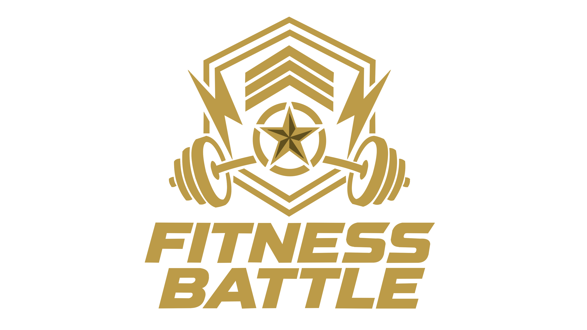
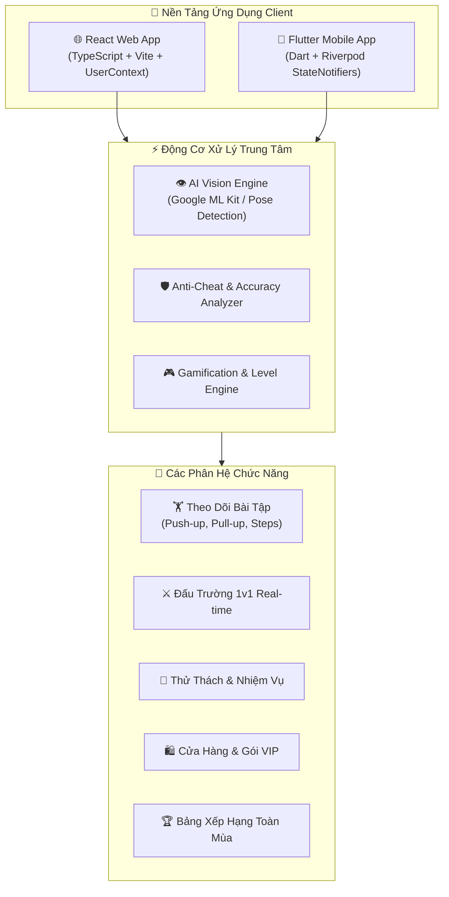

<p align="center">
  
</p>

<h1 align="center">⚔️ FITNESS BATTLE 🏋️</h1>

<p align="center">
  <b>Hệ Sinh Thái Luyện Tập Thể Thao Gamification & Đấu Trường AI Real-Time</b>
</p>

<p align="center">
  <a href="https://exe-fitness-battle.vercel.app" target="_blank">
    
  </a>
  
  
  
  
  
</p>

---

## 📌 Mục Lục
- [Giới Thiệu Dự Án](#-giới-thiệu-dự-án)
- [Kiến Trúc Hệ Thống](#-kiến-trúc-hệ-thống)
- [Tính Năng Trọng Tâm](#-tính-năng-trọng-tâm)
- [Ngăn Xếp Công Nghệ (Tech Stack)](#-ngăn-xếp-công-nghệ-tech-stack)
- [Cấu Trúc Thư Mục](#-cấu-trúc-thư-mục)
- [Hướng Dẫn Cài Đặt & Chạy Môi Trường Local](#-hướng-dẫn-cài-đặt--chạy-môi-trường-local)
- [Triển Khai & Phân Phối (Deployment)](#-triển-khai--phân-phối-deployment)
  - [Triển Khai Web Trên Vercel](#1-triển-khai-web-lên-vercel)
  - [Build Mobile App (Android & iOS)](#2-build--triển-khai-mobile-app-flutter)
- [Đội Ngũ Phát Triển & Bản Quyền](#-đội-ngũ-phát-triển--bản-quyền)

---

## 📖 Giới Thiệu Dự Án

**Fitness Battle** là giải pháp công nghệ thể thao thế hệ mới giải quyết vấn đề thiếu động lực và nhàm chán khi tập luyện thể dục tại nhà bằng cách **Game hóa (Gamification)** toàn diện hành trình rèn luyện:
- 🤖 **AI Pose Tracking:** Ứng dụng thị giác máy tính nhận diện tư thế, đếm rep tự động và cảnh báo sai form thời gian thực.
- ⚔️ **Đấu Trường 1v1 (Battle Arena):** Thách đấu bạn bè trong phòng đấu 60s, so tài thể lực và phân định thắng thua trực tiếp.
- 🎯 **Hệ Thống Thử Thách & Phần Thưởng:** Nhiệm vụ hàng ngày/hàng tuần tích lũy XP, Ruby, Coins để nâng hạng và mở khóa skin độc quyền.
- 🌐 **Đồng Bộ Hoàn Hảo Web & Mobile:** Trải nghiệm thống nhất 1:1 giữa nền tảng Web App (React + TypeScript) và Mobile App (Flutter).

---

## 🏗️ Kiến Trúc Hệ Thống



---

## 🌟 Tính Năng Trọng Tâm

| Phân Hệ | Mô Tả Tính Năng | Điểm Nổi Bật |
|---|---|---|
| **🏋️ AI Workout Tracker** | Theo dõi các bài tập **Hít Đất (Push-up)**, **Kéo Xà (Pull-up)** và **Đi Bộ (Walking)** | Tự động phân tích góc khớp khuỷu/vai, tính % chuẩn form, phát hiện gian lận. |
| **⚔️ Battle Arena 1v1** | Phòng thi đấu 60 giây đối kháng trực tiếp | Chia đôi camera so tài trực tiếp, tính điểm realtime, tiền cược Ruby & quà thưởng. |
| **🎯 Nhiệm Vụ & Thử Thách** | Nhiệm vụ Hàng ngày, Tuần và Sự kiện Mùa | Nhận thưởng tức thì (+XP, +Coins, +Ruby) và tự động ghi nhận vào lịch sử. |
| **🛍️ Cửa Hàng Vật Phẩm** | Mua sắm khung avatar, danh hiệu độc quyền, hiệu ứng chiến thắng | Trừ tiền tương tác thực, lưu trữ danh sách vật phẩm đã sở hữu. |
| **👑 Gói Hội Viên (VIP)** | 4 hạng thẻ: Free, Basic, Premium và VIP Pro | Nhận đặc quyền x1.5 điểm thưởng, giảm phí tạo phòng battle, bảo toàn streak. |
| **🏆 Bảng Xếp Hạng Đa Năng** | Bảng xếp hạng điểm tổng và bảng xếp hạng riêng từng môn | Vinh danh Top 3 Podium (🥇 🥈 🥉), tự động cập nhật thứ hạng của cá nhân. |

---

## 💻 Ngăn Xếp Công Nghệ (Tech Stack)

### 1. Frontend Web App
- **Framework:** React 19 (TypeScript)
- **Bundler & Build Tool:** Vite 6
- **Routing:** React Router v7 (SPA routing với Vercel Rewrites)
- **State Management:** React Context API + LocalStorage Persistent Store
- **Styling & UI:** Vanilla CSS Variables & Design Tokens (Dark Mode, Glassmorphism, Glow FX)
- **Icons:** Lucide React

### 2. Mobile App (Flutter)
- **Framework:** Flutter 3.x / Dart SDK ^3.13.0
- **State Management:** Flutter Riverpod 2.6.x (`StateNotifierProvider`)
- **Navigation:** GoRouter 14.8.x (`ShellRoute` Bottom Navigation)
- **AI & Vision:** Google ML Kit Pose Detection & Camera 0.11.x
- **Sensors:** Pedometer (Đếm bước chân phần cứng)
- **Charts & UI:** FL Chart, Percent Indicator, Google Fonts

---

## 📂 Cấu Trúc Thư Mục

```
FitnessBattle_EXE/Demo MVP/
├── public/                     # Static assets (Logo.png, Favicon, Icons)
├── assets/images/              # Flutter mobile assets (Logo.png)
│
├── src/                        # 🌐 SOURCE CODE REACT WEB
│   ├── components/             # Reusable UI components & Bottom Navigation
│   ├── context/                # UserContext.tsx (Reactive Centralized Store)
│   ├── data/                   # Initial Seed Mock Data
│   ├── pages/                  # Màn hình (Home, Battle, Exercise, Shop, v.v.)
│   ├── types/                  # TypeScript Data Models
│   ├── App.tsx                 # App Shell & Router
│   ├── index.css               # Design System Tokens & Animations
│   └── main.tsx                # React entry point
│
├── lib/                        # 📱 SOURCE CODE FLUTTER MOBILE
│   ├── core/                   # Theme, Base Models, Providers & Widgets
│   ├── features/               # Các module chức năng (Clean Architecture):
│   │   ├── home/               # Màn hình chính & Dashboard
│   │   ├── exercise/           # AI Camera Tracking & Pedometer
│   │   ├── battle/             # Đấu trường 1v1 & Matchmaking
│   │   ├── challenge/          # Thử thách & Claim Reward
│   │   ├── shop/               # Cửa hàng skin & vật phẩm
│   │   ├── membership/         # Nâng cấp gói hội viên
│   │   ├── leaderboard/        # Bảng xếp hạng toàn mùa
│   │   └── profile/            # Hồ sơ cá nhân & Cài đặt
│   ├── router/                 # GoRouter App Routing
│   └── main.dart               # Flutter entry point
│
├── CHAY_DEMO.bat               # Script chạy nhanh cả Web & Mobile
├── pubspec.yaml                # Cấu hình Flutter dependencies
├── package.json                # Cấu hình Web dependencies
└── vercel.json                 # Cấu hình triển khai Vercel SPA
```

---

## 🚀 Hướng Dẫn Cài Đặt & Chạy Môi Trường Local

### Cách 1: Chạy Tự Động Bằng 1 Click (Windows)
Chạy file script [**`CHAY_DEMO.bat`**](file:///d:/Coder-Program/FitnessBattle_EXE/Demo%20MVP/CHAY_DEMO.bat) tại thư mục gốc của dự án để khởi động đồng thời cả Web và Mobile.

---

### Cách 2: Chạy Từng Nền Tảng Thủ Công

#### 🌐 1. Chạy Frontend Web (React / Vite)
```bash
# 1. Di chuyển vào thư mục dự án
cd "Demo MVP"

# 2. Cài đặt các gói thư viện
npm install

# 3. Khởi động máy chủ phát triển
npm run dev
```
> Truy cập trình duyệt tại địa chỉ: `http://localhost:5173`

#### 📲 2. Chạy Mobile App (Flutter)
```bash
# 1. Di chuyển vào thư mục dự án
cd "Demo MVP"

# 2. Tải dependencies Flutter
flutter pub get

# 3. Khởi chạy ứng dụng (trên máy ảo Android/iOS hoặc thiết bị thật)
flutter run
```

---

## 🌐 Triển Khai & Phân Phối (Deployment)

### 1. Triển Khai Web Lên Vercel
🔗 **Link Production Chính Thức:** [https://exe-fitness-battle.vercel.app](https://exe-fitness-battle.vercel.app)

#### Deploy qua Vercel Dashboard:
1. Kết nối kho lưu trữ GitHub `TomOutfit/EXE_FitnessBattle` trên [Vercel Dashboard](https://vercel.com).
2. Thiết lập cấu hình:
   - **Framework Preset:** `Vite`
   - **Root Directory:** `./`
   - **Build Command:** `npm run build`
   - **Output Directory:** `dist`
3. Bấm **Deploy**. Vercel tự động nhận diện file `vercel.json` để kích hoạt SPA rewrite routing.

---

### 2. Build & Triển Khai Mobile App (Flutter)

```bash
# Build Android APK Release (cài đặt trực tiếp)
flutter build apk --release

# Build Android App Bundle (AAB - Đăng Google Play Store)
flutter build appbundle --release

# Build iOS IPA Release (Đăng Apple App Store / TestFlight)
flutter build ipa --release
```

---

## 👨‍💻 Đội Ngũ Phát Triển & Bản Quyền

- **Repository:** [TomOutfit/EXE_FitnessBattle](https://github.com/TomOutfit/EXE_FitnessBattle)
- **Chủ trì & Quản lý Dự án:** [TomOutfit](https://github.com/TomOutfit) (Nguyễn Bình An)
- **Đồng sáng lập & Lập trình chính:** [Teng122](https://github.com/Teng122) (Đồng Hoàng Nguyên)
- **Thành viên phát triển:** Nguyễn Nhật Huy, Dư Gia Phú, Lê Minh Sang, Trần Văn Hiếu
- **Phiên bản:** `v1.0.0 (MVP Release)`
- **Giấy phép:** MIT License

<p align="center">
  <sub>Made with ❤️ by <b>TomOutfit</b> & <b>Teng122</b> for EXE Fitness Battle Project.</sub>
</p>
