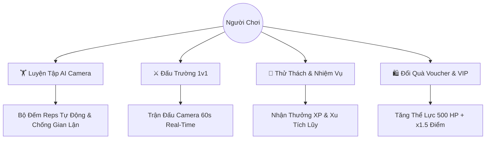

# 🏋️ Fitness Battle — Nền Tảng Luyện Tập Thể Thao Đấu Trường AI Real-Time

<p align="center">
  <a href="https://exe-fitness-battle.vercel.app" target="_blank">
    
  </a>
  
  
  
  
</p>

> 🚀 **Fitness Battle** là hệ sinh thái luyện tập thể thao thông minh kết hợp trí tuệ nhân tạo (AI Pose Tracking) và cơ chế Gamification: Đấu trường thi đấu thời gian thực 1v1 (Battle Arena), Thử thách (Challenges), Bảng xếp hạng (Leaderboards), Đổi Voucher quà tặng & Gói Hội Viên VIP. Dự án bao gồm cả **Frontend Web App** và **Mobile App (Flutter)**.

---

## 🌐 1. Triển Khai Frontend Web Lên Vercel (Deployment)

### 🔗 Link Web Dự Án Chính Thức:
👉 **[https://exe-fitness-battle.vercel.app](https://exe-fitness-battle.vercel.app)**

---

### 🚀 Hướng Dẫn Deploy Web Lên Vercel

#### Cách 1: Deploy Tự Động Qua Vercel Dashboard (Khuyên dùng)
1. Truy cập [Vercel Dashboard](https://vercel.com) và đăng nhập bằng tài khoản GitHub.
2. Nhấn **"Add New..."** ➔ Chọn **"Project"**.
3. Import repository: `TomOutfit/EXE_FitnessBattle`.
4. Thiết lập cấu hình dự án (Project Settings):
   - **Framework Preset**: `Vite`
   - **Root Directory**: `./` (hoặc thư mục chứa `package.json` của Web)
   - **Build Command**: `npm run build`
   - **Output Directory**: `dist`
   - **Install Command**: `npm install`
5. Nhấn **"Deploy"**. Vercel sẽ tự động build và cấp phát URL production dạng `https://exe-fitness-battle.vercel.app`.

#### Cách 2: Deploy Qua Vercel CLI
```bash
# Cài đặt Vercel CLI toàn cục
npm install -g vercel

# Đăng nhập tài khoản Vercel
vercel login

# Deploy trực tiếp từ thư mục dự án
vercel --prod
```

> **Ghi chú định tuyến SPA:** Dự án đã cấu hình sẵn file [`vercel.json`](file:///d:/Coder-Program/FitnessBattle_EXE/Demo%20MVP/vercel.json) để xử lý định tuyến phía client (Client-side Routing), đảm bảo tất cả các URL (`/exercise`, `/battle`, `/ranking`, `/shop`, `/membership`) hoạt động trơn tru mà không bị lỗi 404 khi tải lại trang.

---

## 📱 2. Hướng Dẫn Build & Triển Khai Mobile App (Flutter)

Mobile App được xây dựng bằng Flutter 3.x, tối ưu hóa cho cả hai nền tảng **Android** và **iOS**.

### 🛠️ Yêu Cầu Môi Trường
- Flutter SDK `>=3.22.0`
- Dart SDK `>=3.4.0`
- Android Studio / Xcode
- Android SDK (API Level 24 trở lên)

---

### 🤖 A. Build Cho Nền Tảng Android

#### 1. Build File Cài Đặt Trực Tiếp (APK)
```bash
# Di chuyển vào thư mục Mobile App
cd fitness_battle

# Cài đặt dependencies
flutter pub get

# Build file APK Release (tất cả kiến trúc CPU)
flutter build apk --release

# Hoặc build APK tách theo từng kiến trúc CPU (tối ưu dung lượng tải)
flutter build apk --release --split-per-abi
```
📍 *File APK sau khi build nằm tại:* `build/app/outputs/flutter-apk/app-release.apk`

#### 2. Build Android App Bundle (AAB) Để Đăng Lên Google Play Store
```bash
flutter build appbundle --release
```
📍 *File AAB sau khi build nằm tại:* `build/app/outputs/bundle/release/app-release.aab`

---

### 🍏 B. Build Cho Nền Tảng iOS

```bash
# Di chuyển vào thư mục iOS và cài CocoaPods
cd fitness_battle/ios
pod install
cd ..

# Build file IPA Release
flutter build ipa --release
```
📍 *Mở Xcode để tải lên TestFlight hoặc App Store Connect qua Organizer.*

---

### 🚀 C. Các Kênh Phân Phối Mobile Khuyên Dùng

| Kênh | Mục Đích | Hướng Dẫn Tóm Tắt |
|---|---|---|
| **Firebase App Distribution** | Thử nghiệm nội bộ (Internal Testing) | Tải file `.apk` lên Firebase Console ➔ Mời email tester tải app qua App Tester. |
| **Google Play Internal Track** | Thử nghiệm Google Play | Tải file `.aab` lên Google Play Console ➔ Danh sách tester nhận bản cập nhật trực tiếp từ CH Play. |
| **Apple TestFlight** | Thử nghiệm iOS | Phân phối bản build iOS cho tối đa 10,000 tester qua ứng dụng TestFlight. |
| **GitHub Releases** | Tải trực tiếp file APK | Đính kèm `app-release.apk` vào tab **Releases** của GitHub Repo `TomOutfit/EXE_FitnessBattle`. |

---

## ✨ 3. Các Tính Năng Nổi Bật Của Hệ Thống



- **🏋️ AI Camera & Pose Tracking:** Nhận diện và đếm số rep chuẩn xác cho các bài tập **Hít Đất (Push-up)**, **Kéo Xà (Pull-up)**, **Đi Bộ (Walking)** kèm cảnh báo chống gian lận (Anti-cheat).
- **⚔️ Đấu Trường Real-Time 1v1:** Thi đấu trực tiếp qua Camera chia đôi màn hình trong 60 giây, tự động so điểm và phân định thắng/thua.
- **🏆 Bảng Xếp Hạng Đa Dạng:** Bục vinh quang 3D (🥇 🥈 🥉) cho bảng xếp hạng Toàn Mùa và từng bộ môn riêng biệt.
- **🎯 Hệ Thống Thử Thách:** Nhiệm vụ Hàng ngày, Hàng tuần với tính năng Nhận Thưởng cộng dồn XP và Xu ngay lập tức.
- **🛍️ Cửa Hàng Voucher & Gói VIP:** Đổi Xu lấy voucher Phúc Long, Shopee, WheyStore, Cali Fitness; nâng cấp VIP Pro tăng thể lực lên 500 HP.

---

## 💻 4. Chạy Dự Án Ở Môi Trường Local

### Chạy Frontend Web (React / Vite)
```bash
# Cài đặt thư viện
npm install

# Chạy server phát triển
npm run dev

# Kiểm tra & Build Production
npm run build
```

### Chạy Mobile App (Flutter)
```bash
cd fitness_battle
flutter pub get
flutter run
```

---

## 👨‍💻 Tác Giả & Bản Quyền
- **Repository:** [TomOutfit/EXE_FitnessBattle](https://github.com/TomOutfit/EXE_FitnessBattle)
- **Quản lý & Phát triển:** [TomOutfit](https://github.com/TomOutfit) & [Teng122](https://github.com/Teng122)
- **Phiên bản:** `v1.0.0 (MVP Release)`
